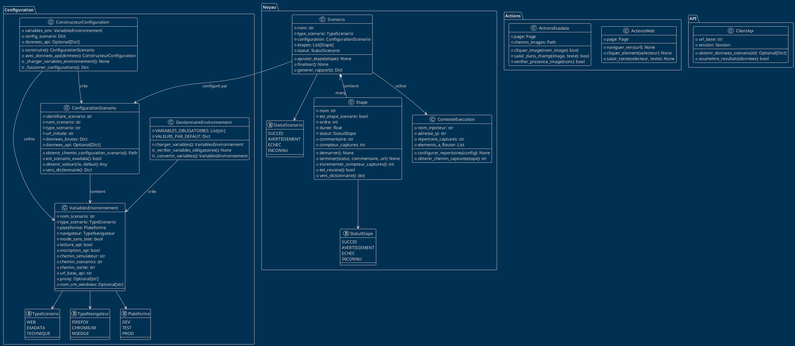

# Diagramme de Classes - Format Flowchart

## Code pour Flowchart/Draw.io

Copiez le code ci-dessous et importez-le dans votre outil de diagramme :

```mermaid
classDiagram
    %%  MODULE CONFIGURATION 
    class VariablesEnvironnement {
        +nom_scenario: str
        +type_scenario: TypeScenario
        +plateforme: Plateforme
        +navigateur: TypeNavigateur
        +mode_sans_tete: bool
        +lecture_api: bool
        +inscription_api: bool
        +chemin_simulateur: str
        +chemin_scenarios: str
        +chemin_sortie: str
        +url_base_api: str
        +proxy: Optional[str]
        +nom_vm_windows: Optional[str]
    }

    class ConfigurationScenario {
        +identifiant_scenario: str
        +nom_scenario: str
        +type_scenario: str
        +plateforme: str
        +url_initiale: str
        +navigateur: str
        +mode_sans_tete: bool
        +proxy: Optional[str]
        +chemin_simulateur: str
        +chemin_scenarios: str
        +chemin_sortie: str
        +api_activee: bool
        +inscription_activee: bool
        +generer_har: bool
        +donnees_brutes: Dict
        +donnees_api: Optional[Dict]
        +variables_env: Optional[VariablesEnvironnement]
        --
        +obtenir_chemin_configuration_scenario(): Path
        +obtenir_chemin_configuration_commune(nom): Path
        +obtenir_chemin_utilisateur_isac(): Optional[Path]
        +est_scenario_exadata(): bool
        +obtenir_valeur(cle, defaut): Any
        +vers_dictionnaire(): Dict
    }

    class GestionnaireEnvironnement {
        +VARIABLES_OBLIGATOIRES: List[str]
        +VALEURS_PAR_DEFAUT: Dict[str, str]
        --
        +charger_variables(): VariablesEnvironnement
        -_verifier_variables_obligatoires(): None
        -_lire_variables_avec_defauts(): dict
        -_convertir_variables(variables_brutes): VariablesEnvironnement
        -_valider_selon_type_scenario(variables): None
        -_convertir_booleen(valeur): bool
    }

    class ConstructeurConfiguration {
        +variables_env: Optional[VariablesEnvironnement]
        +config_scenario: Dict
        +config_commune: Dict
        +donnees_api: Optional[Dict]
        --
        +construire(): ConfigurationScenario
        +avec_donnees_api(donnees): ConstructeurConfiguration
        -_charger_variables_environnement(): None
        -_charger_configuration_scenario(): None
        -_charger_configuration_commune(): None
        -_fusionner_configurations(): Dict
        -_adapter_par_plateforme(config): Dict
        -_construire_configuration_finale(config): ConfigurationScenario
        -_determiner_generation_har(config): bool
    }

    %%  MODULE NOYAU 
    class Etape {
        +nom: str
        +est_etape_scenario: bool
        +ordre: int
        +heure_debut: Optional[datetime]
        +duree: float
        +statut: StatutEtape
        +url_courante: str
        +commentaire: str
        +compteur_captures: int
        +donnees_supplementaires: dict
        -_timestamp_debut: Optional[float]
        --
        +demarrer(): None
        +terminer(statut, commentaire, url): None
        +incrementer_compteur_captures(): int
        +ajouter_donnee(cle, valeur): None
        +obtenir_donnee(cle, defaut): Any
        +marquer_comme_infrastructure(): None
        +est_reussie(): bool
        +est_en_echec(): bool
        +obtenir_duree_formatee(): str
        +obtenir_statut_texte(): str
        +vers_dictionnaire(): dict
    }

    class Scenario {
        +nom: str
        +type_scenario: TypeScenario
        +configuration: ConfigurationScenario
        +donnees_api: Optional[Dict]
        +heure_debut: datetime
        +duree: float
        +statut: StatutScenario
        +commentaire: str
        +etapes: List[Etape]
        +compteur_etapes: int
        +contexte_execution: ContexteExecution
        --
        +ajouter_etape(etape): None
        +obtenir_etapes_scenario(): List[Etape]
        +obtenir_etapes_infrastructure(): List[Etape]
        +finaliser(): None
        +calculer_duree_totale(): float
        +determiner_statut_final(): StatutScenario
        +generer_rapport(): Dict
        +vers_dictionnaire(): Dict
    }

    class ContexteExecution {
        +nom_injecteur: str
        +adresse_ip: str
        +navigateur_utilise: str
        +heure_demarrage: datetime
        +repertoire_captures: Optional[str]
        +repertoire_rapports: Optional[str]
        +elements_a_flouter: List
        +url_initiale_header: str
        --
        +configurer_repertoires(config): None
        +ajouter_element_flou(element): None
        +nettoyer_elements_flous(): None
        +obtenir_chemin_capture(etape, numero): str
        +obtenir_informations_systeme(): Dict
    }

    %%  ENUMERATIONS 
    class TypeScenario {
        <<enumeration>>
        WEB
        EXADATA
        TECHNIQUE
    }

    class TypeNavigateur {
        <<enumeration>>
        FIREFOX
        CHROMIUM
        MSEDGE
    }

    class Plateforme {
        <<enumeration>>
        DEV
        TEST
        PROD
    }

    class StatutEtape {
        <<enumeration>>
        SUCCES
        AVERTISSEMENT
        ECHEC
        INCONNU
    }

    class StatutScenario {
        <<enumeration>>
        SUCCES
        AVERTISSEMENT
        ECHEC
        INCONNU
    }

    %%  MODULES FUTURS (PREVUS) 
    class ActionsWeb {
        +page: Page
        --
        +naviguer_vers(url): None
        +cliquer_element(selecteur): None
        +saisir_texte(selecteur, texte): None
        +attendre_element(selecteur): Locator
        +obtenir_texte(selecteur): str
    }

    class ActionsExadata {
        +page: Page
        +chemin_images: Path
        +recognizer: ImageRecognizer
        --
        +cliquer_image(nom_image, confiance): bool
        +saisir_dans_champ(image_champ, texte): bool
        +verifier_presence_image(nom_image): bool
        -_trouver_element(chemin_image, confiance): Optional[Tuple]
    }

    class ClientApi {
        +url_base: str
        +timeout: int
        +session: Session
        --
        +obtenir_donnees_scenario(id): Optional[DonneesApi]
        +soumettre_resultats(donnees): bool
    }

    class FabriqueNavigateur {
        --
        +creer_navigateur(config): Browser
        +configurer_proxy(config): dict
        +obtenir_options_lancement(config): dict
    }

    class RapporteurJson {
        --
        +generer_rapport(scenario): dict
        +sauvegarder_rapport(donnees, chemin): None
        +formater_donnees_execution(scenario): dict
    }

    class GestionnaireCaptures {
        --
        +prendre_capture(execution, etape, page): str
        +ajouter_annotations(page, titre): None
        +flouter_elements(elements): None
        +ajouter_curseur(element): None
    }

    %%  RELATIONS 
    VariablesEnvironnement ||--|| GestionnaireEnvironnement : "créé par"
    ConfigurationScenario ||--|| ConstructeurConfiguration : "créé par"
    ConstructeurConfiguration --> VariablesEnvironnement : "utilise"
    ConfigurationScenario --> VariablesEnvironnement : "contient"
    
    Scenario ||--|| ConfigurationScenario : "configuré par"
    Scenario ||--o{ Etape : "contient"
    Scenario ||--|| ContexteExecution : "utilise"
    
    Etape --> StatutEtape : "a un"
    Scenario --> StatutScenario : "a un"
    VariablesEnvironnement --> TypeScenario : "a un"
    VariablesEnvironnement --> TypeNavigateur : "a un"
    VariablesEnvironnement --> Plateforme : "a un"
    
    %% Relations futures
    ActionsWeb --> Scenario : "utilisé par"
    ActionsExadata --> Scenario : "utilisé par"
    ClientApi --> ConfigurationScenario : "utilise"
    FabriqueNavigateur --> ConfigurationScenario : "utilise"
    RapporteurJson --> Scenario : "génère rapport de"
    GestionnaireCaptures --> Etape : "capture pour"
```

## Alternative : Format PlantUML

Si vous préférez PlantUML, voici la version équivalente :



## Instructions d’Import

### Pour Flowchart/Lucidchart :

1. Copiez le code Mermaid
1. Dans votre outil, recherchez “Import from text” ou “Mermaid”
1. Collez le code et laissez l’outil générer le diagramme

### Pour Draw.io/Diagrams.net :

1. Allez dans “Arrange” → “Insert” → “Advanced” → “Mermaid”
1. Collez le code Mermaid
1. Ou utilisez le code PlantUML si supporté

### Pour Visual Studio Code :

1. Installez l’extension “Mermaid Preview”
1. Créez un fichier `.md` avec le code Mermaid
1. Utilisez Ctrl+Shift+V pour prévisualiser

## Notes sur le Diagramme

**Classes Implémentées** (✅) :

- VariablesEnvironnement, ConfigurationScenario
- GestionnaireEnvironnement, ConstructeurConfiguration
- Etape avec StatutEtape

**Classes Prévues** (🔄) :

- Scenario, ContexteExecution
- ActionsWeb, ActionsExadata
- ClientApi, FabriqueNavigateur
- RapporteurJson, GestionnaireCaptures

**Relations Clés** :

- Composition : Scenario contient plusieurs Etapes
- Association : Configuration utilise VariablesEnvironnement
- Dépendance : Actions utilisent les classes métier

Voici comment faire des relations :

Defining Relationship ​

A relationship is a general term covering the specific types of logical connections found on class and object diagrams.

[classA][Arrow][ClassB]code

There are eight different types of relations defined for classes under UML which are currently supported:
Type 	Description
<|-- 	Inheritance
*-- 	Composition
o-- 	Aggregation
--> 	Association
-- 	Link (Solid)
..> 	Dependency
..|> 	Realization
.. 	Link (Dashed)

classDiagram
classA <|-- classB
classC *-- classD
classE o-- classF
classG <-- classH
classI -- classJ
classK <.. classL
classM <|.. classN
classO .. classP
