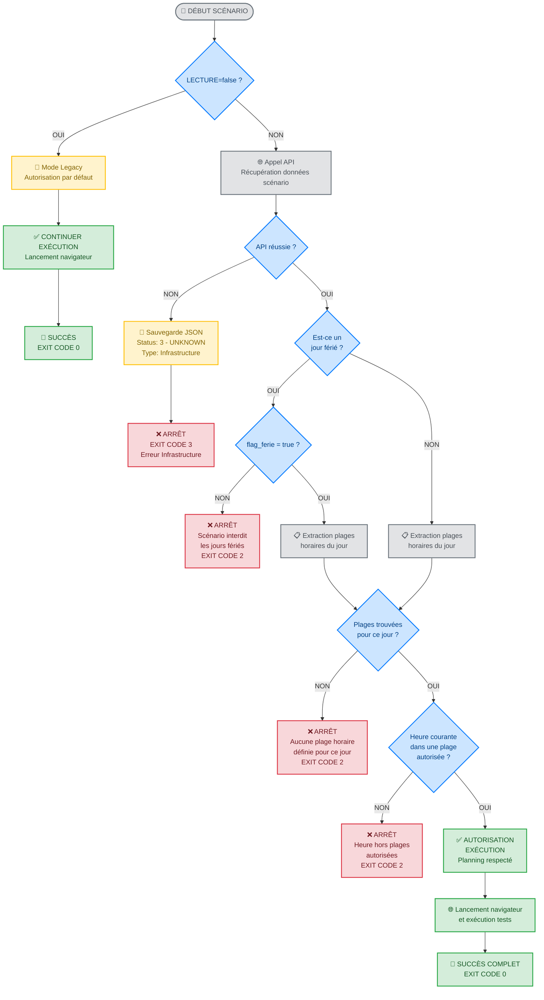

# Algorithme de vérification du planning d'exécution des scénarios

## Vue d'ensemble

L'algorithme de vérification du planning d'exécution détermine si un scénario de test automatisé est autorisé à s'exécuter à un moment donné. Cette vérification s'effectue très tôt dans le processus, avant le lancement du navigateur, pour optimiser les ressources Jenkins.

## Arbre de décision (Graphique Mermaid)

Le diagramme ci-dessous illustre le flux complet de décision pour la vérification du planning d'exécution :



## Légende des codes de sortie

| Code | Type | Signification | Action exploitants |
|------|------|---------------|-------------------|
| **0** | SUCCESS | Scénario exécuté avec succès | Aucune action |
| **2** | SCÉNARIO | Erreur liée au scénario (planning non respecté) | Vérifier la logique applicative |
| **3** | INFRASTRUCTURE | Erreur technique (API indisponible, etc.) | Contacter l'équipe de test automatisé |

## Points clés de l'algorithme

### ⚡ **Optimisation performance**
- Vérification **très tôt** dans le processus (avant navigateur)
- Arrêt **immédiat** si planning non respecté
- **Traitement minimal** pour les violations

### 🔄 **Compatibilité legacy**
- `LECTURE=false` → Autorisation par défaut (pas de changement)
- `LECTURE=true` → Vérification complète avec gestion d'erreurs

### 📊 **Différenciation des erreurs**
- **Status 2** : Problème de scénario → Les exploitants doivent analyser
- **Status 3** : Problème d'infrastructure → Équipe test automatisé à contacter

### 🎯 **Plages horaires multiples**
- Support des créneaux discontinus (ex: 8h-12h + 14h-18h)
- **Logique OR** : une seule plage valide suffit
- Messages d'erreur détaillés avec toutes les plages disponibles

## Données d'entrée

L'algorithme utilise les données récupérées via l'API du scénario, notamment :

```json
{
  "flag_ferie": true|false|null,
  "planning": [
    {
      "jour": 1,
      "heure_debut": "07:00:00",
      "heure_fin": "22:00:00"
    },
    {
      "jour": 2,
      "heure_debut": "07:00:00", 
      "heure_fin": "22:00:00"
    }
  ]
}
```

### Signification des champs

- **`flag_ferie`** : 
  - `true` : Le scénario peut s'exécuter les jours fériés
  - `false` ou `null` : Le scénario ne doit PAS s'exécuter les jours fériés
  
- **`planning`** : Tableau des créneaux d'exécution autorisés
  - **`jour`** : Numéro du jour de la semaine (1=Lundi, 7=Dimanche, format ISO)
  - **`heure_debut`** : Heure de début de la plage (format HH:MM:SS)
  - **`heure_fin`** : Heure de fin de la plage (format HH:MM:SS)

## Algorithme détaillé

### Étape 1 : Récupération du contexte temporel

```
DÉBUT
  obtenir_date_heure_courante()
  numero_jour_semaine = date_courante.isoweekday()  // 1=Lundi, 7=Dimanche
  est_jour_ferie = verifier_jour_ferie_france(date_courante)
```

### Étape 2 : Vérification du critère "jour férié"

```
SI est_jour_ferie = VRAI ALORS
  SI flag_ferie ≠ VRAI ALORS
    ARRÊTER_EXECUTION("Scénario non autorisé les jours fériés")
  FIN SI
FIN SI
```

**Logique** : Si nous sommes un jour férié ET que le flag n'est pas explicitement à `true`, alors l'exécution est interdite.

### Étape 3 : Extraction des plages horaires du jour

```
plages_horaires_jour = []

POUR CHAQUE plage DANS planning FAIRE
  SI plage.jour = numero_jour_semaine ALORS
    ajouter plage À plages_horaires_jour
  FIN SI
FIN POUR

SI plages_horaires_jour est VIDE ALORS
  ARRÊTER_EXECUTION("Aucune plage horaire définie pour ce jour")
FIN SI

// À ce stade, plages_horaires_jour peut contenir 1 ou N plages pour le même jour
// Exemple : [
//   {"jour": 1, "heure_debut": "07:00:00", "heure_fin": "12:00:00"},
//   {"jour": 1, "heure_debut": "14:00:00", "heure_fin": "22:00:00"}
// ]
```

### Étape 4 : Vérification de l'heure d'exécution (plages multiples)

```
heure_courante = extraire_heure(date_heure_courante)
execution_autorisee = FAUX

// Parcourir TOUTES les plages horaires du jour courant
// Il suffit qu'UNE seule plage soit valide pour autoriser l'exécution
POUR CHAQUE plage DANS plages_horaires_jour FAIRE
  heure_debut = convertir_en_time(plage.heure_debut)
  heure_fin = convertir_en_time(plage.heure_fin)
  
  SI heure_debut ≤ heure_courante ≤ heure_fin ALORS
    execution_autorisee = VRAI
    LOGGER.info("Exécution autorisée dans la plage " + heure_debut + "-" + heure_fin)
    SORTIR DE LA BOUCLE  // Pas besoin de vérifier les autres plages
  FIN SI
FIN POUR

SI execution_autorisee = FAUX ALORS
  // Construire un message détaillé avec toutes les plages disponibles
  plages_disponibles = ""
  POUR CHAQUE plage DANS plages_horaires_jour FAIRE
    plages_disponibles += plage.heure_debut + "-" + plage.heure_fin + " "
  FIN POUR
  
  ARRÊTER_EXECUTION("Heure actuelle (" + heure_courante + ") hors des plages autorisées: " + plages_disponibles)
FIN SI

CONTINUER_EXECUTION()
FIN
```

## Cas d'usage et exemples

### Exemple 1 : Exécution autorisée

**Contexte :**
- Date : Mercredi 30 juillet 2025, 14h30
- Jour férié : Non
- Planning : Lundi-Vendredi 07h00-22h00

**Déroulement :**
1. ✅ Pas un jour férié → Pas de vérification du flag_ferie
2. ✅ Mercredi = jour 3, plage trouvée : 07h00-22h00
3. ✅ 14h30 est comprise entre 07h00 et 22h00
4. **Résultat : EXÉCUTION AUTORISÉE**

### Exemple 2 : Jour férié interdit

**Contexte :**
- Date : 1er janvier 2025 (Jour de l'An), 10h00
- flag_ferie : null
- Planning : Tous les jours 00h00-23h59

**Déroulement :**
1. ❌ Jour férié détecté ET flag_ferie ≠ true
2. **Résultat : EXÉCUTION INTERDITE** ("Scénario non autorisé les jours fériés")

### Exemple 3 : Plages horaires multiples (pause déjeuner)

**Contexte :**
- Date : Lundi 28 juillet 2025, 13h15
- Jour férié : Non  
- Planning : 
  - Lundi 07h00-12h00 (matin)
  - Lundi 14h00-22h00 (après-midi)

**Déroulement :**
1. ✅ Pas un jour férié
2. ✅ Lundi = jour 1, **2 plages trouvées** : 07h00-12h00 et 14h00-22h00
3. ❌ 13h15 n'est PAS dans 07h00-12h00
4. ❌ 13h15 n'est PAS dans 14h00-22h00
5. **Résultat : EXÉCUTION INTERDITE** ("Heure actuelle (13:15) hors des plages autorisées: 07:00-12:00 14:00-22:00")

### Exemple 4 : Exécution autorisée dans la 2ème plage

**Contexte :**
- Date : Lundi 28 juillet 2025, 15h30
- Jour férié : Non  
- Planning : 
  - Lundi 07h00-12h00 (matin)
  - Lundi 14h00-22h00 (après-midi)

**Déroulement :**
1. ✅ Pas un jour férié
2. ✅ Lundi = jour 1, **2 plages trouvées**
3. ❌ 15h30 n'est PAS dans 07h00-12h00
4. ✅ 15h30 EST dans 14h00-22h00
5. **Résultat : EXÉCUTION AUTORISÉE** (arrêt de la vérification dès la première plage valide)

### Exemple 5 : Weekend non programmé

**Contexte :**
- Date : Samedi 2 août 2025, 10h00
- Jour férié : Non
- Planning : Lundi-Vendredi seulement

**Déroulement :**
1. ✅ Pas un jour férié
2. ❌ Samedi = jour 6, aucune plage définie
3. **Résultat : EXÉCUTION INTERDITE** ("Aucune plage horaire définie pour ce jour")

## Gestion des cas d'erreur

### Données manquantes ou invalides

| Situation | Comportement |
|-----------|-------------|
| `planning` absent ou vide | Arrêt avec erreur "Planning non défini" |
| Format d'heure invalide | Arrêt avec erreur "Format horaire invalide" |
| `flag_ferie` absent | Traité comme `false` (pas d'exécution les jours fériés) |
| Plage horaire incohérente (fin < début) | Arrêt avec erreur "Plage horaire invalide" |

### Gestion des plages horaires chevauchantes

Si plusieurs plages horaires sont définies pour le même jour, l'algorithme les traite comme des créneaux alternatifs. Il suffit qu'UNE plage soit valide pour autoriser l'exécution.

**Exemple :**
```json
"planning": [
  {"jour": 1, "heure_debut": "08:00:00", "heure_fin": "12:00:00"},
  {"jour": 1, "heure_debut": "14:00:00", "heure_fin": "18:00:00"}
]
```
Exécution autorisée le lundi entre 8h-12h OU entre 14h-18h.

## Intégration technique

### Point d'entrée
La vérification s'effectue dans `execution.py` lors de l'initialisation du scénario, après récupération des données API.

### Arrêt d'exécution
En cas de violation du planning, l'algorithme utilise `pytest.exit(2)` pour arrêter proprement l'exécution avant le lancement des tests.

### Logging
Tous les contrôles et décisions sont tracés via le système de logging existant du projet pour faciliter le débogage et l'audit.

## Évolutions futures possibles

1. **Support des fuseaux horaires** : Gestion des décalages horaires pour des déploiements internationaux
2. **Plages horaires sur plusieurs jours** : Support des créneaux 22h00-06h00 (nuit)
3. **Calendrier personnalisé** : Définition de jours fériés spécifiques à l'organisation
4. **Fenêtres de maintenance** : Exclusion de créneaux pour maintenance système
5. **Priorités de scénarios** : Exécution prioritaire de certains scénarios même hors planning
