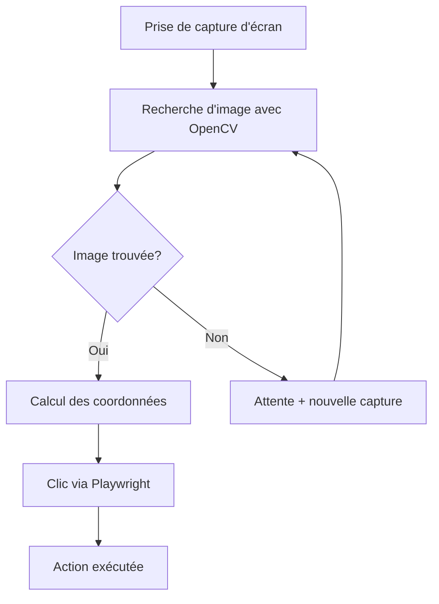

# Documentation complète - Automatisation Exadata

## Vue d’ensemble

Ce système d’automatisation permet d’exécuter des scénarios de test sur des environnements Exadata en utilisant :

- **Guacamole** : Interface web pour accéder à distance aux machines Windows
- **Windows 11** : Système d’exploitation cible
- **Firefox** : Navigateur pour l’interface Guacamole
- **Playwright** : Framework d’automatisation web
- **OpenCV** : Bibliothèque de vision par ordinateur pour la reconnaissance d’images

## Architecture et fonctionnement

### Principe général

Playwright est conçu pour l’automatisation web, mais les scénarios Exadata nécessitent d’interagir avec des applications Windows natives. La solution utilise Guacamole comme pont :

1. **Guacamole** expose l’interface Windows via un navigateur web
1. **Playwright** contrôle le navigateur et donc indirectement Windows
1. **OpenCV** identifie les éléments d’interface par reconnaissance d’images
1. **Les coordonnées** trouvées sont transmises à Playwright pour les clics

### Flux d’exécution type



## Configuration préalable

### Variable d’environnement

Définir la variable d’environnement pour spécifier la VM cible :

```bash
export NOM_VM_WINDOWS="nom_de_votre_vm"
```

Cette variable est utilisée pour se connecter à la bonne machine virtuelle via Guacamole.

### Configuration Firefox

**Configuration cruciale pour le bon fonctionnement :**

#### 1. Désactiver l’enregistrement des identifiants

- Aller dans `Paramètres` > `Vie privée et sécurité`
- Section **Connexions**, décocher :
  - ✗ Demander l’enregistrement des identifiants et mots de passe des sites web
  - ✗ Suggérer des mots de passe forts et uniques

#### 2. Configuration automatique des fichiers .jnlp

- Aller dans `Paramètres` > `Général` > `Applications`
- Rechercher le type de fichier **JNLP** (Java Network Launch Protocol)
- Définir l’action sur **Ouvrir automatiquement**
- Associer à l’application Java appropriée

#### 3. Paramètres de téléchargement

- Dans `Paramètres` > `Général` > `Fichiers et applications`
- Section **Téléchargements** :
  - Cocher “Toujours demander où enregistrer les fichiers” : ✗ (désactivé)
  - Définir un dossier de téléchargement par défaut

## Organisation des images de référence

### Structure des dossiers

Les images doivent être organisées de manière structurée pour faciliter la maintenance :

```
scenarios_exadata/
├── images/
│   ├── 01_connexion/
│   │   ├── 01_champ_utilisateur.png
│   │   ├── 02_champ_mot_de_passe.png
│   │   ├── 03_bouton_connexion.png
│   │   └── 04_validation_connexion.png
│   ├── 02_navigation/
│   │   ├── 01_menu_principal.png
│   │   ├── 02_sous_menu_exadata.png
│   │   └── 03_icone_application.png
│   ├── 03_configuration/
│   │   ├── 01_onglet_parametres.png
│   │   ├── 02_zone_configuration.png
│   │   └── 03_bouton_sauvegarder.png
│   └── 04_validation/
│       ├── 01_popup_confirmation.png
│       ├── 02_message_succes.png
│       └── 03_bouton_fermer.png
├── img/
│   └── screenshot_ecran.png  # Capture temporaire
└── scenarios/
    ├── scenario_connexion.py
    ├── scenario_configuration.py
    └── scenario_validation.py
```

### Règles de nommage

1. **Dossiers** : `XX_nom_etape/` (numérotés selon l’ordre d’exécution)
1. **Images** : `XX_description_element.png` (numérotées dans l’ordre d’utilisation)
1. **Correspondance** : Le nom du dossier doit correspondre au nom de l’étape dans le code

### Conseils pour les captures d’images

- **Résolution identique** : Capturer les images à la même résolution que celle utilisée par Playwright
- **Zone minimale** : Capturer uniquement la zone nécessaire (bouton, champ, icône)
- **Fond stable** : Éviter les éléments qui changent (curseur, animations)
- **Format PNG** : Utiliser PNG pour préserver la qualité
- **Noms explicites** : Utiliser des noms clairs et descriptifs

## Utilisation des modules

### Module `trouver_coordonnees_image.py`

```python
from .trouver_coordonnees_image import trouver_coordonnees_image

# Recherche simple
coords = trouver_coordonnees_image("images/01_connexion/01_bouton_ok.png")

# Avec paramètres personnalisés
coords = trouver_coordonnees_image(
    template_path="images/bouton.png",
    screenshot_path="captures/ecran.png",
    confiance=0.9,  # Plus strict
    debug=True      # Logs détaillés
)
```

### Module `verifier.py`

```python
from .verifier import verifier, attendre_disparition

# Vérification obligatoire avec timeout
coords = verifier(
    image_a_verifier="images/02_navigation/01_menu.png",
    page=page,
    timeout=30
)

# Vérification optionnelle
coords = verifier(
    image_a_verifier="images/popup_erreur.png",
    page=page,
    obligatoire=False,
    timeout=5
)

# Attendre qu'un élément disparaisse (ex: spinner de chargement)
if attendre_disparition("images/spinner.png", page, timeout=60):
    print("Chargement terminé")
```

### Module `cliquer.py`

```python
from .cliquer import cliquer, glisser_deposer

# Clic simple
cliquer("images/03_actions/01_bouton_valider.png", page)

# Clic droit avec timeout personnalisé
cliquer(
    image_click="images/fichier.png",
    page=page,
    bouton="right",
    timeout=10,
    obligatoire=False
)

# Double-clic
cliquer(
    image_click="images/icone_application.png",
    page=page,
    double_clic=True
)

# Glisser-déposer
glisser_deposer(
    image_source="images/fichier.png",
    image_destination="images/zone_depot.png",
    page=page
)
```

### Module `ecrire.py`

```python
from .ecrire import ecrire, ecrire_mot_de_passe, coller_texte

# Saisie simple
ecrire("images/01_connexion/01_champ_nom.png", "jean.dupont", page)

# Saisie avec validation par Entrée
ecrire(
    image_champ_a_remplir="images/champ_recherche.png",
    texte="ma recherche",
    page=page,
    valider_avec_entree=True
)

# Saisie de mot de passe sécurisée
ecrire_mot_de_passe(
    "images/01_connexion/02_champ_mdp.png",
    "mon_mot_de_passe",
    page
)

# Collage de texte long
coller_texte(
    "images/champ_description.png",
    "Un très long texte...",
    page
)
```

## Gestion des timeouts et compteurs

### Principe du système de compteur

Le système utilise un **compteur dégressif** pour gérer les timeouts :

```python
# Configuration
timeout = 30  # secondes
intervalle = 0.2  # secondes entre chaque vérification
nb_iterations = int(timeout / intervalle)  # = 150 itérations

# Boucle de vérification
iteration_actuelle = 0
while element_non_trouve and iteration_actuelle < nb_iterations:
    time.sleep(intervalle)
    iteration_actuelle += 1
    # ... vérification ...
```

### Calcul des timeouts

- **Timeout total** : `nb_iterations × intervalle`
- **Exemple** : 150 itérations × 0.2s = 30 secondes maximum
- **Progression** : Log tous les 25 essais (≈ 5 secondes)

### Recommandations de timeout

|Type d’élément   |Timeout recommandé  |Cas d’usage              |
|-----------------|--------------------|-------------------------|
|**5 secondes**   |Éléments rapides    |Boutons, menus, champs   |
|**10 secondes**  |Éléments standard   |Popups, dialogues        |
|**30 secondes**  |Éléments lents      |Chargements, applications|
|**60 secondes**  |Processus longs     |Connexions, installations|
|**120+ secondes**|Opérations critiques|Déploiements, migrations |

## Gestion des erreurs et debugging

### Logs détaillés

Activer les logs pour le debugging :

```python
import logging
logging.basicConfig(level=logging.INFO)

# Ou pour encore plus de détails
logging.basicConfig(level=logging.DEBUG)
```

### Erreurs communes et solutions

#### 1. Image non trouvée

```
Erreur: Image 'bouton.png' non trouvée (confiance 0.65 < 0.8)
```

**Solutions :**

- Vérifier la résolution de capture
- Ajuster le seuil de confiance
- Recapturer l’image dans les bonnes conditions

#### 2. Timeout expiré

```
Erreur: Élément non trouvé après 30.0s (150 tentatives)
```

**Solutions :**

- Augmenter le timeout
- Vérifier que l’élément est bien visible
- Contrôler l’état de l’application

#### 3. Fichier non trouvé

```
FileNotFoundError: L'image de référence n'existe pas: images/bouton.png
```

**Solutions :**

- Vérifier le chemin de l’image
- Contrôler l’organisation des dossiers
- S’assurer que l’image existe

### Mode debug avancé

```python
# Activer le debug dans la recherche d'images
coords = trouver_coordonnees_image(
    "images/element.png",
    debug=True  # Affiche dimensions, confiance, position
)

# Sauvegarder les captures pour analyse
page.screenshot(path=f"debug/capture_{timestamp}.png", full_page=True)
```

## Exemple de scénario complet

```python
"""
Exemple de scénario de connexion Exadata
"""
import os
from playwright.sync_api import sync_playwright
from modules.verifier import verifier
from modules.cliquer import cliquer
from modules.ecrire import ecrire, ecrire_mot_de_passe

def scenario_connexion_exadata():
    """Scénario de connexion à un environnement Exadata"""
    
    # Configuration
    nom_vm = os.getenv('NOM_VM_WINDOWS', 'default_vm')
    url_guacamole = f"https://guacamole.example.com/#/client/{nom_vm}"
    
    with sync_playwright() as p:
        # Lancement du navigateur
        browser = p.firefox.launch(headless=False)
        page = browser.new_page()
        
        try:
            # 1. Connexion à Guacamole
            print("🔗 Connexion à Guacamole...")
            page.goto(url_guacamole)
            page.set_viewport_size({"width": 1920, "height": 1080})
            
            # 2. Attendre l'interface Windows
            print("⏳ Attente de l'interface Windows...")
            verifier("images/01_connexion/01_desktop_windows.png", page, timeout=60)
            
            # 3. Ouvrir l'application Exadata
            print("🚀 Ouverture de l'application...")
            cliquer("images/01_connexion/02_icone_exadata.png", page)
            
            # 4. Connexion utilisateur
            print("👤 Saisie des identifiants...")
            ecrire("images/01_connexion/03_champ_utilisateur.png", "admin", page)
            ecrire_mot_de_passe("images/01_connexion/04_champ_mdp.png", "password123", page)
            cliquer("images/01_connexion/05_bouton_connexion.png", page)
            
            # 5. Vérification de la connexion
            print("✅ Vérification de la connexion...")
            coords = verifier("images/01_connexion/06_interface_principale.png", page, timeout=30)
            
            if coords:
                print("✅ Connexion réussie!")
                return True
            else:
                print("❌ Échec de la connexion")
                return False
                
        except Exception as e:
            print(f"❌ Erreur dans le scénario: {e}")
            # Capture d'écran pour debugging
            page.screenshot(path=f"debug/erreur_{int(time.time())}.png")
            return False
            
        finally:
            browser.close()

if __name__ == "__main__":
    succes = scenario_connexion_exadata()
    exit(0 if succes else 1)
```

## Bonnes pratiques

### 1. Structuration du code

- Un module par type d’action (clic, saisie, vérification)
- Un scénario par fichier avec nom explicite
- Gestion d’erreurs systématique

### 2. Gestion des images

- Organisation hiérarchique par étapes
- Noms descriptifs et numérotation
- Résolution constante et qualité optimale

### 3. Timeouts adaptés

- Courts pour les éléments rapides (5s)
- Longs pour les chargements (30-60s)
- Très longs pour les processus critiques (120s+)

### 4. Robustesse

- Vérifications multiples avant actions critiques
- Captures d’écran en cas d’erreur
- Logs détaillés pour le debugging

### 5. Maintenance

- Tests réguliers des images de référence
- Mise à jour selon les évolutions d’interface
- Documentation des changements

## Dépannage avancé

### Problèmes de résolution

Si les images ne sont pas reconnues, vérifier :

1. La résolution de Playwright : `page.set_viewport_size({"width": 1920, "height": 1080})`
1. La résolution des captures de référence
1. Le facteur de zoom du navigateur

### Problèmes de performance

Pour optimiser les performances :

1. Réduire les timeouts pour les éléments rapides
1. Augmenter l’intervalle de vérification si approprié
1. Utiliser des images plus petites quand possible

### Problèmes de stabilité

Pour améliorer la stabilité :

1. Ajouter des délais après les actions importantes
1. Vérifier l’état de l’application entre les étapes
1. Implémenter des mécanismes de retry