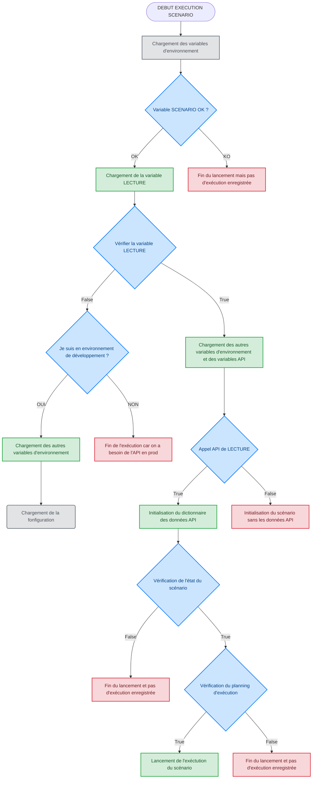

```mermaid
flowchart TD
%% Lancement du scénario avec JENKINS %%
Start([DEBUT EXECUTION SCENARIO]) --> LancementJenkins[Chargement des variables d'environnement]

%% Vérifier la variable SCENARIO %%
LancementJenkins --> ValiderVariableScenario{Variable SCENARIO OK ?}
ValiderVariableScenario -->|OK| VariableScenarioOK[Chargement de la variable LECTURE]
ValiderVariableScenario -->|KO| VariableScenarioKO[Fin du lancement mais pas d'exécution enregistrée]

%% Vérifier la variable de LECTURE de l'API %%
VariableScenarioOK --> VariableLecture{Vérifier la variable LECTURE}
VariableLecture -->|True| VariableLectureTrue[Chargement des autres variables d'environnement et des variables API]
VariableLecture -->|False| VerifierDev{Je suis en environnement de développement ?}
VerifierDev --> |OUI| VerifierDevOUI[Chargement des autres variables d'environnement]
VerifierDev -->|NON| VerifierDevNON[Fin de l'exécution car on a besoin de l'API en prod]

%% %%
VerifierDevOUI --> ChargementConfig(Chargement de la fonfiguration)

%% Appel API %%
VariableLectureTrue --> AppelAPI{Appel API de LECTURE}
AppelAPI -->|True| AppelAPITrue[Initialisation du dictionnaire des données API]
AppelAPI -->|False| AppelAPIFalse[Initialisation du scénario sans les données API]

%%  %%
AppelAPITrue --> VerifierEtatActivation{Vérification de l'état du scénario}
VerifierEtatActivation -->|False| VerifierEtatActivationFalse[Fin du lancement et pas d'exécution enregistrée]

%%  %%
VerifierEtatActivation -->|True| PlanningExecution{Vérification du planning d'exécution}
PlanningExecution -->|True| PlanningExecutionTrue[Lancement de l'exéctution du scénario]
PlanningExecution -->|False| PlanningExecutionFalse[Fin du lancement et pas d'exécution enregistrée]

%% Style des noeuds %%
classDef succesClass fill:#d4edda,stroke:#28a745,stroke-width:2px,color:#155724
classDef erreurClass fill:#f8d7da,stroke:#dc3545,stroke-width:2px,color:#721c24
classDef attentionClass fill:#fff3cd,stroke:#ffc107,stroke-width:2px,color:#856404
classDef processClass fill:#e2e3e5,stroke:#6c757d,stroke-width:2px,color:#495057
classDef decisionClass fill:#cce5ff,stroke:#007bff,stroke-width:2px,color:#004085


%% Application des styles %%
class LancementJenkins,ChargementConfig processClass
class ValiderVariableScenario,VariableLecture,VerifierDev,AppelAPI,VerifierEtatActivation,PlanningExecution decisionClass
class VariableScenarioOK,VariableLectureTrue,VerifierDevOUI,AppelAPITrue,PlanningExecutionTrue succesClass
class VariableScenarioKO,VerifierDevNON,VerifierEtatActivationFalse,AppelAPIFalse,PlanningExecutionFalse erreurClass
%% class attentionClass
```
